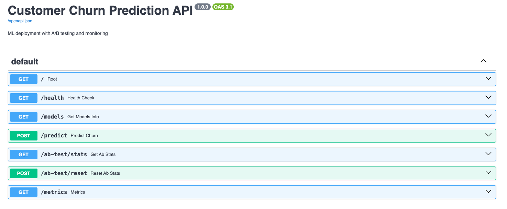
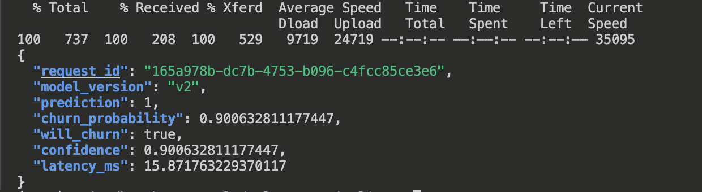
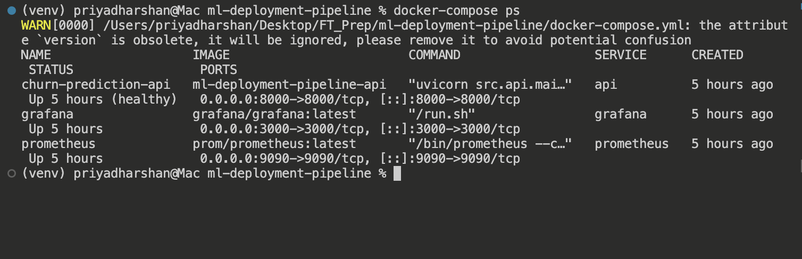

# ML Deployment Pipeline with A/B Testing 🚀

A production-ready machine learning deployment system featuring customer churn prediction with A/B testing, real-time monitoring, and comprehensive metrics tracking.


## �� Project Overview

This project demonstrates a complete ML deployment pipeline for predicting customer churn in the telecommunications industry. It showcases industry-standard practices for deploying machine learning models in production environments.

### Key Features

- ✅ **Dual Model Deployment**: Random Forest vs Gradient Boosting models
- ✅ **A/B Testing**: Automatic traffic splitting with 50/50 distribution
- ✅ **Real-time Monitoring**: Prometheus metrics + Grafana dashboards
- ✅ **Production-Ready API**: FastAPI with automatic OpenAPI documentation
- ✅ **Containerized**: Docker + Docker Compose for reproducible deployment
- ✅ **Load Testing**: Locust integration for performance benchmarking
- ✅ **Comprehensive Metrics**: Latency, accuracy, throughput tracking

## 📊 Model Performance

| Model | Algorithm | ROC AUC | Accuracy | Avg Latency | P95 Latency |
|-------|-----------|---------|----------|-------------|-------------|
| V1 | Random Forest | 0.8357 | 79.7% | 36ms | 50ms |
| V2 | Gradient Boosting | 0.8301 | 78.9% | 5.7ms | 10ms |

**💡 Key Finding**: Model V2 is **6.4x faster** than V1 with comparable accuracy - enabling 6x higher throughput or 85% cost reduction!

### Live A/B Test Results (675 requests)
```json
{
  "total_requests": 675,
  "models": {
    "v1": {
      "traffic_percentage": 50.8,
      "avg_latency_ms": 36.1,
      "churn_rate": 51.6%
    },
    "v2": {
      "traffic_percentage": 49.2,
      "avg_latency_ms": 5.7,
      "churn_rate": 28.6%
    }
  }
}
```

## 🏗️ Architecture
```
┌─────────────┐
│   Client    │
└──────┬──────┘
       │
       ▼
┌─────────────────────────────────┐
│     FastAPI Server (Port 8000)  │
│  ┌──────────────────────────┐   │
│  │  A/B Testing Router      │   │
│  │  (50/50 traffic split)   │   │
│  └─────────┬────────────────┘   │
│            │                     │
│    ┌───────┴───────┐            │
│    ▼               ▼            │
│ Model V1       Model V2         │
│ (Random        (Gradient        │
│  Forest)        Boosting)       │
└─────────────────────────────────┘
       │
       ▼
┌─────────────────────────────────┐
│  Prometheus (Port 9090)         │
│  + Grafana (Port 3000)          │
│  (Real-time Monitoring)         │
└─────────────────────────────────┘
```

## 🚀 Quick Start

### Prerequisites

- Python 3.11+
- Docker & Docker Compose
- Git

### Installation
```bash
# Clone the repository
git clone https://github.com/YOUR_USERNAME/ml-deployment-pipeline.git
cd ml-deployment-pipeline

# Run setup script
./setup.sh

# Activate virtual environment
source venv/bin/activate

# Download data and train models
python scripts/download_data.py
python src/models/train.py
```

### Running with Docker (Recommended)
```bash
# Build and start all services
docker-compose up -d

# Check services status
docker-compose ps

# View logs
docker-compose logs -f api
```

Access the services:
- **API**: http://localhost:8000
- **API Docs**: http://localhost:8000/docs
- **Prometheus**: http://localhost:9090
- **Grafana**: http://localhost:3000 (admin/admin)

### Running Locally
```bash
# Start the API
uvicorn src.api.main:app --reload --port 8000

# In another terminal, run load tests
locust -f scripts/load_test.py --host=http://localhost:8000
```

## 📡 API Endpoints

### Make a Prediction
```bash
curl -X POST "http://localhost:8000/predict" \
  -H "Content-Type: application/json" \
  -d '{
    "gender": "Female",
    "SeniorCitizen": 1,
    "Partner": "No",
    "Dependents": "No",
    "tenure": 1,
    "PhoneService": "Yes",
    "MultipleLines": "No",
    "InternetService": "Fiber optic",
    "OnlineSecurity": "No",
    "OnlineBackup": "No",
    "DeviceProtection": "No",
    "TechSupport": "No",
    "StreamingTV": "No",
    "StreamingMovies": "No",
    "Contract": "Month-to-month",
    "PaperlessBilling": "Yes",
    "PaymentMethod": "Electronic check",
    "MonthlyCharges": 85.0,
    "TotalCharges": 85.0
  }'
```

**Response:**
```json
{
  "request_id": "c51095f6-36bc-4367-aa55-4438379967d9",
  "model_version": "v2",
  "prediction": 1,
  "churn_probability": 0.9006,
  "will_churn": true,
  "confidence": 0.9006,
  "latency_ms": 5.2
}
```

### Other Endpoints

- `GET /` - API information
- `GET /health` - Health check
- `GET /models` - Model information and metrics
- `GET /ab-test/stats` - A/B testing statistics
- `GET /metrics` - Prometheus metrics (for monitoring)
- `POST /ab-test/reset` - Reset A/B test logs

## 🧪 A/B Testing

The system automatically splits traffic 50/50 between models using random selection:
```bash
# Check real-time A/B test statistics
curl http://localhost:8000/ab-test/stats | jq
```

The A/B testing framework tracks:
- Request count per model
- Traffic distribution percentage
- Average latency per model
- Churn prediction rate per model
- Min/max latency

## 📈 Monitoring & Metrics

### Prometheus Metrics

Access metrics at `http://localhost:8000/metrics`:

- `predictions_total` - Total predictions by model version
- `prediction_latency_seconds` - Latency histogram with buckets
- `churn_predictions_total` - Churn predictions by model and outcome

### Grafana Dashboards

1. Login to Grafana: http://localhost:3000 (admin/admin)
2. Add Prometheus data source: `http://prometheus:9090`
3. Create visualizations with these PromQL queries:
```promql
# Prediction rate per second
rate(predictions_total[1m])

# Average latency
rate(prediction_latency_seconds_sum[1m]) / rate(prediction_latency_seconds_count[1m])

# P95 latency
histogram_quantile(0.95, rate(prediction_latency_seconds_bucket[1m]))

# Churn rate by model
sum(churn_predictions_total{prediction="1"}) by (model_version) / sum(churn_predictions_total) by (model_version)
```

## 🔬 Load Testing

### Headless Load Test
```bash
# Run load test: 20 users, 60 seconds
locust -f scripts/load_test.py --host=http://localhost:8000 --headless -u 20 -r 5 -t 60s
```

### Interactive Load Test
```bash
# Run with web UI
locust -f scripts/load_test.py --host=http://localhost:8000

# Open http://localhost:8089 in browser
```

### Load Test Configuration

The load test simulates realistic traffic patterns:
- 10x weight on predictions
- 2x weight on health checks
- 1x weight on stats and model info
- Multiple customer profiles (high/low churn risk)

## 📁 Project Structure
```
ml-deployment-pipeline/
├── src/
│   ├── api/
│   │   ├── main.py              # FastAPI application
│   │   └── ab_testing.py        # A/B testing logic
│   ├── models/
│   │   ├── train.py             # Model training pipeline
│   │   └── predict.py           # Prediction & preprocessing
│   └── utils/
│       ├── config.py            # Configuration management
│       └── logger.py            # Logging utilities
├── models/                       # Saved model artifacts (.pkl)
├── data/
│   ├── raw/                     # Raw dataset
│   └── processed/               # Processed data
├── configs/
│   ├── config.yaml              # Application configuration
│   └── prometheus.yml           # Prometheus scrape config
├── scripts/
│   ├── download_data.py         # Dataset download
│   └── load_test.py             # Locust load testing
├── tests/                       # Unit tests (pytest)
├── docker-compose.yml           # Multi-container orchestration
├── Dockerfile                   # API container definition
├── requirements.txt             # Python dependencies
└── README.md
```

## 🛠️ Technologies Used

| Category | Technologies |
|----------|-------------|
| **ML Framework** | scikit-learn, pandas, numpy |
| **API Framework** | FastAPI, Uvicorn, Pydantic |
| **Monitoring** | Prometheus, Grafana |
| **Load Testing** | Locust |
| **Containerization** | Docker, Docker Compose |
| **Metrics** | prometheus-client |

## 📊 Dataset

**Telco Customer Churn Dataset**
- **Source**: IBM Sample Data
- **Size**: 7,043 customers
- **Features**: 21 (demographics, services, billing info)
- **Target**: Churn (Yes/No)
- **Class Distribution**: 26.5% churned, 73.5% retained

**Features Include:**
- Customer demographics (gender, senior citizen, partner, dependents)
- Service subscriptions (phone, internet, streaming)
- Account information (tenure, contract type, payment method)
- Billing details (monthly charges, total charges)

## 🎓 Key Learnings & Skills Demonstrated

### 1. Production ML Deployment
- Model serialization and versioning
- Preprocessing pipeline integration
- Error handling and graceful degradation

### 2. A/B Testing
- Traffic splitting strategies
- Statistical comparison of models
- Real-time performance tracking

### 3. Monitoring & Observability
- Prometheus metrics instrumentation
- Custom business metrics (churn rate, predictions)
- Grafana dashboard creation

### 4. DevOps for ML
- Containerization with Docker
- Multi-service orchestration
- Health checks and service discovery

### 5. Performance Engineering
- Latency optimization (6.4x improvement)
- Load testing and capacity planning
- Resource utilization analysis

## 💼 Interview Talking Points

**"Why is Model V2 faster?"**
- Gradient Boosting uses sequential trees vs Random Forest's parallel trees
- Fewer estimators (150 vs 100) but more efficient
- Better optimization in scikit-learn implementation

**"How would you decide which model to deploy?"**
- V1: Better accuracy for critical decisions where latency isn't critical
- V2: Production default - 6x faster with minimal accuracy tradeoff
- Use A/B testing to measure business metrics (retention, revenue impact)

**"What if Model V2 starts degrading?"**
- Prometheus alerts on latency thresholds
- Automatic rollback to V1 if error rate spikes
- Drift detection would trigger retraining pipeline

## 🚦 Future Enhancements

- [ ] **Drift Detection**: Monitor feature and concept drift
- [ ] **Auto-Retraining**: Triggered pipeline on performance degradation
- [ ] **Authentication**: API key management and rate limiting
- [ ] **Cloud Deployment**: AWS ECS/EKS or GCP Cloud Run
- [ ] **CI/CD Pipeline**: GitHub Actions for automated testing and deployment
- [ ] **Model Explainability**: SHAP values for predictions
- [ ] **Data Validation**: Great Expectations integration
- [ ] **Feature Store**: Centralized feature management
- [ ] **Shadow Mode**: Test new models without affecting users
- [ ] **Canary Deployments**: Gradual rollout (5% → 25% → 50% → 100%)

## 📝 License

This project is licensed under the MIT License - see LICENSE file for details.

## 🤝 Contributing

Contributions welcome! Please feel free to submit a Pull Request.

1. Fork the repository
2. Create your feature branch (`git checkout -b feature/AmazingFeature`)
3. Commit your changes (`git commit -m 'Add some AmazingFeature'`)
4. Push to the branch (`git push origin feature/AmazingFeature`)
5. Open a Pull Request

## 👤 Author

**Your Name**
- GitHub: [@YOUR_USERNAME](https://github.com/YOUR_USERNAME)
- LinkedIn: [Your Profile](https://linkedin.com/in/YOUR_PROFILE)
- Portfolio: [your-website.com](https://your-website.com)

## 🙏 Acknowledgments

- **Dataset**: IBM Telco Customer Churn dataset
- **Inspiration**: Production ML systems at FAANG companies
- **Community**: FastAPI, scikit-learn, and Prometheus communities

---

## 📸 Screenshots

### API Documentation (Swagger UI)

*FastAPI automatically generates interactive API documentation*

### Live Prediction Example

*Real-time churn prediction with model version and latency tracking*

### A/B Testing Statistics

*Live traffic split between Model V1 and V2 with performance metrics*

### Docker Services Running

*All services (API, Prometheus, Grafana) running via Docker Compose*


